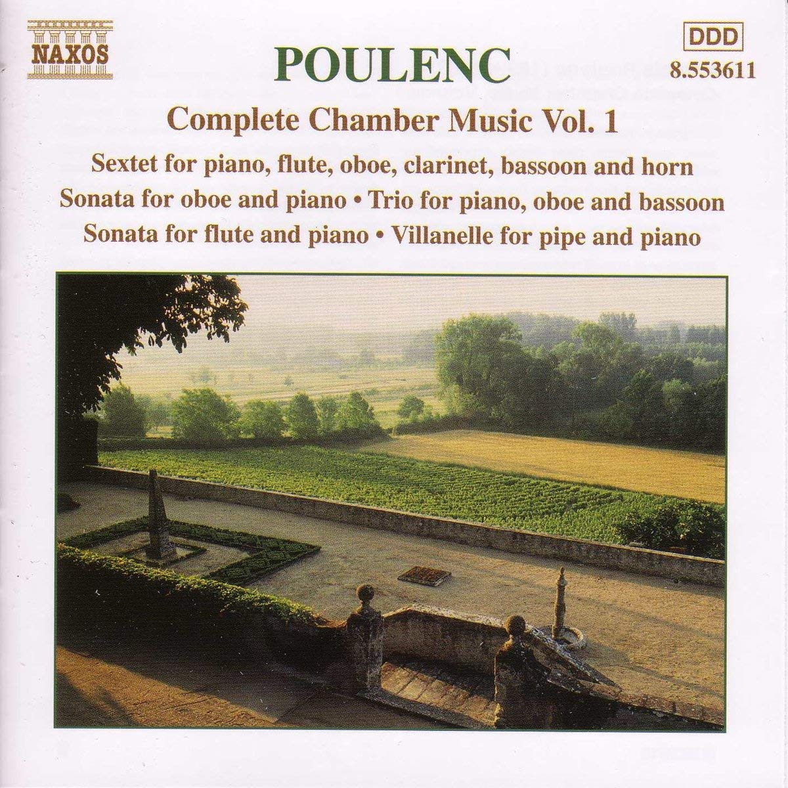

# テストページです
[mainページ](index)  
# 第1部

## フルートソナタ
#### プーランク
###### 10:40 - 10:52
* ここに曲紹介を書きます。
* 紹介1 普通の文字
* 紹介2 *強調1*
* 紹介3  **強調2**
* 紹介4 ***強調3***
* 画像も埋め込みできる



```
  これは使いづらいかも？
```
* 長い曲紹介長い曲紹介長い曲紹介長い曲紹介長い曲紹介長い曲紹介長い曲紹介長い曲紹介長い曲紹介長い曲紹介長い曲紹介長い曲紹介長い曲紹介長い曲紹介長い曲紹介長い曲紹介長い曲紹介長い曲紹介長い曲紹介
* [リンク](https://ja.wikipedia.org/wiki/フルートソナタ_(プーランク))

## ピアノトリオ
#### フォーレ
###### 10:55 - 11:05
必死さも色気もパワーアップした(？)演奏をどうぞ！

## 三つの小品
#### イベール
###### 11:08 - 11:18
フィロムジカの皆様ならきっともう何度も聞いたことがあるでしょう。木管五重奏では王道のとても楽しい曲です。軽やかな1・3楽章と牧歌的な2楽章、美しくオシャレなハーモニーをお楽しみください。

## 弦楽四重奏
#### フォーレ
###### 11:21 - 11:44
* 曲紹介スペース

## フルートとピアノのためのソナチネ
#### サンカン
###### 11:47 - 11:59
* 曲紹介スペース

# 第2部

## Piano Quintet in F minor, Op 34, 1st mov.
#### Brahms
###### 12:40 - 12:55
「ピアノのいる室内楽ってあんまりやったことなくない？」「じゃやるか！」
とかいう軽いきっかけで始まった企画ですが、曲は恐ろしいほど激重です。ブラームスが完成まで2年かけたというこの大曲を、じっくりとお楽しみください。

## フルートとピアノとハープのためのソナタ
#### ドビュッシー
###### 12:58 - 13:16
* 曲紹介スペース

## ファゴットソナタ
#### ヒンデミット
###### 13:19 - 13:29
以前からやりたいと思ってたヒンデミットのソナタを、西井先生の協力のもと挑戦します。この曲の不思議な雰囲気を感じ取ってもらえれば幸いです。

## Summer Music
#### バーバー
###### 13:32 - 13:43
* 曲紹介スペース

# 第3部

## 4つのワルツ より3,4楽章
#### ショスタコーヴィチ
###### 14:25 - 14:32
ショスタコーヴィッチと聞くと、派手な交響曲や重い作品をイメージする方も多いのではないでしょうか。今回演奏する4つのワルツは、そんなイメージとは全く異なる作品です。

ショスタコーヴィッチは舞台音楽や映画音楽も多く作曲しており、この四つのワルツは彼の原曲を友人が編曲したものとなっています。

第3曲の優雅な円舞曲、第4曲のピッコロの響きが可愛らしい軽快なワルツをお楽しみください。

## Jive for Five
#### Paul Nagle
###### 14:35 - 14:41
演奏会も終盤にさしかかったところで、これまでと少しテイストの異なる曲をお聞きください。

"Jive"とは、ざっくり言うとジャズのことです。

ジャズスタイルの３曲（Swing, Funk Rock, Jazz Waltz）のメドレー形式となっています。

## フルート、ヴィオラ、コントラバスのためのコンツェルティーノ
#### シュルホフ
###### 14:44 - 15:02
* 曲紹介スペース

## ピアノトリオ第1番第1楽章
#### ブラームス
###### 15:05 - 15:21
練習後に立ち寄った「LE BOUCHON OGASAWARA」というお店を紹介します。

------
小笠原シェフの豪快パフォーマンス  
渋谷の大人気ビストロ、ル・ブション・オガサワラ  
4年ぶり2度目の訪問です♪  
  
ブションとはリヨンで居酒屋という意味  
そこでは、安い素材で美味しくて  
ボリュームたっぷりのお料理を出すそうです  
  
こちらル・ブション・オガサワラでも  
満腹で動けないお客さんが続出するそうですが  
やっぱりお腹いっぱいで苦しくなってしまいました  
  
カジュアルな雰囲気の店内には、夜遅めなのに  
楽しそうに談笑するお客さんでいっぱい  
センターのキッチンでは  
小笠原シェフが１人ひたすらフライパンをふります♪  
途切れることのないパフォーマンスがかっこいい！  
------
※食べログ レビューより  
※ちなみに、ガチで練習しました。  

## 夏山の一日
#### ボザ
###### 15:24 - 15:34
田園風景を描写した牧歌、「パストラール」や、森の奥の広場で楽しく戯れるような「ロンド」など、「夏山」の様子が描かれた作品です。各楽章、夏山の一日の空気を感じながらお楽しみください。

1楽章:パストラール

2楽章:急流の淵にて

3楽章:森の詩

4楽章:ロンド

# 第4部

## 交響曲第45番『告別』
#### ハイドン
###### 15:55 - 16:18
* 曲紹介スペース

### [タイムテーブル](timetable)
##### [メインページに戻る](index)